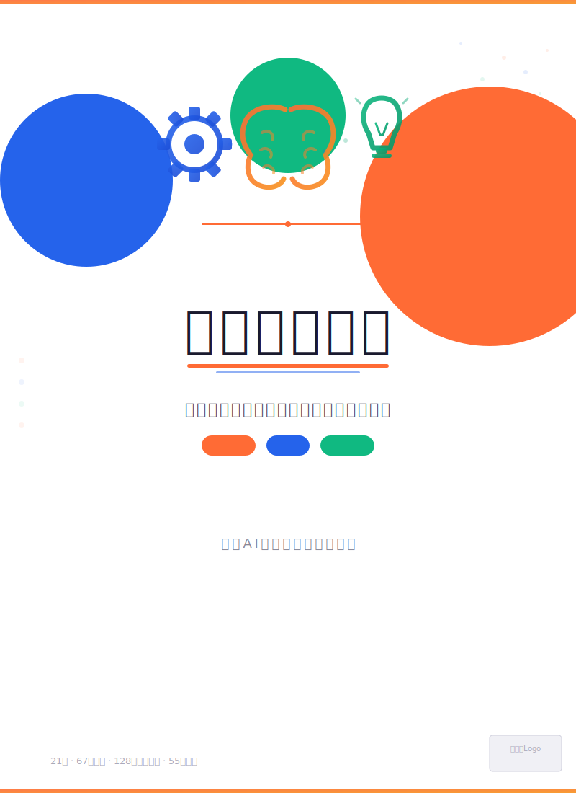

# 《高效学习手册》Efficient Learning Handbook

[](https://creativecommons.org/licenses/by-nc-sa/4.0/)
[](https://alanwhitedj.github.io/efficient-learning-handbook/)
[](https://github.com/AlanWhiteDJ/efficient-learning-handbook)

<p align="center">
  
</p>

> 你从来不是学不好。你只是还没学会怎么跟自己的大脑合作。这本书就是你的合作说明书。

---

## 📖 关于本书

这是一本写给"学得很累但收效甚微"的人的高效学习方法论。

**记不住、理解不了、用不出来、坐不住、没动力** —— 这些不是你不行，是你在用一个和大脑工作原理对着干的系统。本书从脑科学和认知心理学出发，拆解 21 个学习中绕不开的坎，每个坎给你三个方法（简单/进阶/高阶），并配有兜底方案。

## 🧭 全书结构

| 篇章 | 主题 | 核心问题 |
|------|------|----------|
| 记忆篇 | 牢固存储，对抗遗忘 | 为什么背了就忘？ |
| 理解篇 | 深度建构，灵活运用 | 为什么"懂了"却讲不出来？ |
| 应用篇 | 举一反三，灵活迁移 | 换个题型为什么就不会？ |
| 专注篇 | 进入状态，保持高效 | 知道该学，为什么动不了？ |
| 动力篇 | 点燃引擎，持续学习 | 为什么学完没感觉？ |
| 调节篇 | 驾驭系统，学会学习 | 不知道自己哪里不会怎么办？ |
| 拓展篇 | 屏幕·考试·AI | 手机放不下？考场丢分？AI 怎么用？ |

## 📂 文件说明

```
efficient-learning-handbook/
├── 高效学习手册.md          # 全书 Markdown 格式（推荐阅读）
├── 高效学习手册.html        # 全书 HTML 版本（浏览器打开）
├── 00_目录.md              # 详细目录
├── AI推荐语.md             # AI 辅助学习建议
├── 家长指南.md             # 给家长的使用指南
├── cover_front.jpg         # 封面图片
├── illustrations/          # 54 张 SVG 插图
├── cards/                  # 24 张工具卡片
├── LICENSE                 # CC BY-NC-SA 4.0
└── README.md
```

## 📥 下载与阅读

- 🌐 **在线阅读**：[**点击这里在线阅读**](https://alanwhitedj.github.io/efficient-learning-handbook/)（GitHub Pages，无需下载）
- 📄 **离线 HTML**：下载 `高效学习手册.html`，用浏览器直接打开
- 📝 **阅读 Markdown**：下载 `高效学习手册.md`，推荐用 Typora、Obsidian 或 VS Code 打开
- 🖨️ **打印/导出 PDF**：用浏览器打开 HTML 文件 → 打印 → 另存为 PDF

## ⚖️ 许可证

本书采用 [Creative Commons 署名-非商业性使用-相同方式共享 4.0 国际 (CC BY-NC-SA 4.0)](https://creativecommons.org/licenses/by-nc-sa/4.0/) 许可。

**你可以自由地：**
- ✅ 分享 — 在任何媒介以任何形式复制、传播本书
- ✅ 改编 — 修改、转换或以本书为基础进行创作

**但必须遵守：**
- 📝 署名 — 必须标明作者（Alan D.P White）并链接到本许可证
- 🚫 非商业性 — 不得将本书用于商业目的
- 🔗 相同方式共享 — 演绎作品必须采用相同的许可协议

## ✍️ 作者

**Alan D.P White**

---

如果你觉得这本书有用，请 ⭐ Star 这个仓库，让更多人看到。
